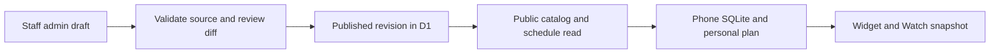

# ConPaws mobile UX exploration

Updated October 2, 2026. **Recommendation: ship a curated convention catalog, an admin publishing flow, and guided setup before expanding personal attendance controls.** Nathanial confirmed convention-day reliability as the priority, named setup confusion as the main pain, and made prefilled conventions/admin a requirement now. Watch and widget quality is the next priority.

The latest visual review and clickable setup/publishing/glance concepts are in `index.html` → **Review & setup**. Run the existing local preview; opening the HTML directly does not run its TypeScript modules. All new sample conventions, feed checks, revisions, events, counts, and dates are fictional. The admin demo does not publish anything.

## October review: what changed and what is real

Review snapshot: HEAD `9f10ae3`; recent commit scope after `8c853a5`, plus the current uncommitted changes. This is a targeted review of changed code and the setup, import, schedule, reminder, Watch/widget paths they touch. It is not a line-by-line audit of the entire repository or a fresh production deployment check.

| Area | Observed change | Implication |
| --- | --- | --- |
| My Schedule | `49dc7cd` adds conflict labels using the shared time helpers | Correct direction, but grouping by start-day leaves overnight collisions unmarked. |
| Import/security | `5d44686` bounds downloads and parsing, fixes feed handling, and adds tests; website waitlist guards also changed | Preserve those limits in any server-side admin ingestion. Early header rejection still needs response cancellation. |
| Website | `1e9b768` moves product previews earlier, simplifies filler, and sharpens English title/description | Useful discovery work; it cannot solve first-run setup inside the app. |
| Exploration | `fb1b512` and `9f10ae3` save and format this prototype/research | The expanded concept still uses sample state; it is not the native implementation. |
| Current working tree | Expo/package/lock/license patch updates, an ignored prebuild-backup path, and an Android splash plugin config | Reviewed as existing work and preserved. The September claim of 18 outdated packages is stale; current compatibility/CI was not reverified. |

Current declared native baseline: Expo `~57.0.23`, Router `~57.0.23`, Expo UI `~57.0.20`, NativeWind `5.0.0-preview.2`, React Native `0.86.3`, React `19.2.3`. Installed/current declarations are evidence, not proof of a passing native archive. The new splash plugin setting needs regenerated native-project inspection during the next build.

### Existing planning context

The connected [Roadmap & Open Questions](https://app.notion.com/p/3c8d61481c7b811caa75f0b6019fee9c) already chooses a hybrid source model: an admin-curated D1 directory plus user iCal/Sched import and manual entry. It places the directory in the later accounts phase. Nathanial's October 2 instruction moves the catalog/admin requirement onto the current critical path; it does not require shipping attendee accounts, profiles, premium sync, or the whole future backend first.

[Screens & Navigation](https://app.notion.com/p/3c8d61481c7b81e2a428f8e49368a6aa) specifies import as the initial action and defers notification permission until the first reminder. Keep the permission timing; replace the main setup action with finding a published convention. Some diagrams still show a planned Profile tab; actual native tabs are Home, Schedule, and Settings. These local findings have not been written back to Notion.

### Hard feedback

1. **The prototype starts too late.** A populated fictional schedule hides the main obstacle: a newcomer must find a compatible source and import it. Full-width rows are valuable after setup succeeds.
2. **An admin dashboard is now justified, but a generic CRUD table is insufficient.** Incorrect dates, time zones, vanished sessions, and a bad publish can disrupt a whole con. Review/publish/rollback are part of the first dashboard.
3. **“Interested,” “Going,” and join/leave editors create product and data complexity.** Native storage has one saved flag. Do not ask users to learn two states before proving it reduces confusion. Keep this as a testable proposal.
4. **The Watch/widget issue is partly state logic.** A beautiful next-panel card still fails when the final panel is in progress. Fix current-only and empty-state semantics before judging decoration.
5. **The app must speak only with the confidence its data supports.** A reminder offset is not a walking-time estimate; a copied snapshot is not a freshly checked organizer schedule; a missing feed is not a publication announcement.
6. **The visible app needs one obvious path.** First run: Find my con. Convention day: My next event and room. Advanced imports, editing, filters, and attendance live one level deeper.

## Standards review

These findings concern recent changes. They are independent from the product/spec findings below.

### P2: overnight conflicts lose their warning

`apps/native/app/(tabs)/schedule/index.tsx:251` computes conflict IDs separately in each start-day section. Two saved events at 23:30–01:00 and 00:15–00:45 share time but live in different sections. A read-only reproduction using the actual `groupPersonalScheduleByDay` and `overlappingEventIds` helpers returned both IDs globally and no IDs with the screen's per-section calculation.

**Fix:** compute conflicts over the relevant live saved entries before display grouping. Keep grouping as presentation only. Preserve the shared policy for missing end times, cancellation, and back-to-back events. Acceptance: both overnight rows announce their overlap; adjacent non-overlapping rows do not.

### P2: rejecting Content-Length does not stop the response

`apps/native/src/lib/bounded-response.ts:21–24` throws when the declared size exceeds the cap, before cancelling `response.body`. Both calendar and ECP paths use this helper. The caller in `sched-extractor.ts` clears its timeout afterward. A stream cancellation-spy reproduction produced `ResponseTooLargeError` with `cancelled: false`.

**Fix:** cancel/abort the download before returning the size error, including early-header rejection. Test both declared-size and streaming-byte rejection. This is a demonstrated resource leak; no out-of-memory crash was demonstrated.

Standards axis: **2 verified findings**. No additional defensible code-smell finding was needed to inflate the review.

## Product/spec review

### Required now: find a prefilled convention

`apps/native/app/(onboarding)/get-started.tsx:84` routes to import. Home promotes import; `src/db/repositories/conventions.ts:9` reads local SQLite. A catalog and admin publishing flow do not exist. This matches the old local MVP scope and conflicts with the newly required setup experience; it is a product gap rather than a broken existing catalog.

**New flow:** Find a convention → confirm edition/dates/time zone → download published schedule → save first panel → optional reminder. Keep Import a schedule and Create manually as visible fallbacks. A missing schedule should explain what is unavailable and offer another action.

### P1: the last active event is discarded by widget state

`apps/native/targets/widget/widgets.swift:138–149` finds a current event, then returns `.empty` when no future event exists. `targets/watch-widget/widgets.swift:409` similarly requires `nextEvent` for a non-blank projection. These branches are verified in source; they were not exercised in WidgetKit on a device in this review.

**Fix:** distinguish `current + next`, `current only`, `next only`, `finished`, and `no saved events`. An unknown end remains unknown; do not declare an event finished from an arbitrary visual fallback. Define behavior when saved events overlap instead of silently presenting one as the user's chosen location.

### P1: refresh can shift a feed by one hour

`src/services/schedule-refresh.ts:111–113` calls `parseIcs` with the saved convention zone as an override. `src/lib/import-policy.ts:47–53` already supplies a shared feed-first parser. Read-only reproduction with `X-WR-TIMEZONE:America/New_York`, floating `DTSTART:20261002T140000`, and saved `America/Chicago`:

| Path | Parsed start |
| --- | --- |
| Initial import, feed preferred | `2026-10-02T18:00:00.000Z` |
| Refresh-style saved-zone override | `2026-10-02T19:00:00.000Z` |

**Fix:** reuse the feed-first helper for refresh. Test declared feed zone, no feed zone with saved fallback, per-event TZID, and missing valid zone. Avoid presenting bulk time changes until this path is consistent.

### P2: reminder and empty-state wording overclaims

`src/services/notifications.ts:119–146` subtracts reminder minutes from published start; it does not know walking time or user location. “Starts in 10 min · Oak” fits the actual data better than “Time to leave.” An explicit user-chosen departure time can justify “Leave at,” but the current model is a lead-time reminder.

Watch's `content.swift:345` uses a shared no-events message, and `targets/_shared/ConPawsStrings.swift:433` can promise another-day event when none exists. Choose wording from actual next-event availability. Update all affected locales together when implementation happens.

### Proposal boundary: advanced attendance is not native behavior

`src/db/schema.ts:27–36` stores published times, `isInSchedule`, and reminder minutes. `src/services/widget-snapshot.ts` publishes snapshot schema v2 without personal attendance fields. The prototype's interests, partial attendance, Watch edits, and Live Activity concepts require new domain state and migration/sync tests. No production ActivityKit behavior was verified here.

Product/spec axis: **1 newly required setup gap, 3 correctness/wording areas, and 1 proposal boundary**. Worst reliability finding: inconsistent time-zone parsing; most important product gap: curated setup.

## Phone flow status coverage

**Review modes:** all 22 baseline states now have compact screen cards together below the full phone preview. Each card opens its full state and copy editor. Play/Pause/Previous/Next controls animate a nine-step scenario walkthrough at three seconds per step: first use → download → skeleton → upcoming/no picks → picks ready → offline saved copy → changed panel → final active panel → day finished. Playback stops on hidden pages or manual selection; reduced-motion users receive state changes without transition animation. This is a visual scenario sequence across different dates, not a connected native onboarding/network simulation.

**Quick-load presentation:** local schedule loading now shows static skeleton time/title/room rows inside the existing screen shell, without a loading illustration or action button. In production, first render cached content when available; delay a skeleton briefly (proposed 150ms, tune after measuring) so near-instant queries do not flash. A refresh preserves actual readable rows and uses a compact status. First downloads and failures retain explicit progress/retry messaging. Announce loading once to assistive technology, hide decorative placeholders, and do not move focus. The selector pins the skeleton for visual review; it does not measure or simulate loading speed.

The **Phone flow** now contains the shared empty/status explorer directly below the three interactive phones, with a toolbar jump link. It includes all ten previous empty/upcoming situations plus twelve proposed status scenarios: local loading, first download, offline with/without a saved copy, refresh in progress, failed update retaining the old copy, catalog unavailable, cancelled event, changed event, denied reminder permission, overlap, and final ongoing pick. The separate state gallery uses the same data and renderer. Wording edits and action dialogs are local preview behavior; loading/refresh statuses must remain nonblocking when a readable local schedule exists. Native network, permissions and event-change handling are not implemented by this preview update.

## Admin website: admin.conpaws.com

**Confirmed October 2:** the dashboard is a real website at **https://admin.conpaws.com**, built with **Next.js, Tailwind CSS, and Better-T Stack conventions**. The publishing card in this review is a concept, not the actual dashboard.

### ADR: separate admin application

**Status:** domain and frontend stack accepted by Nathanial; deployment, authentication, and API details below are proposed. **Date:** October 2, 2026.

**Context:** `apps/web` already uses Next.js 16.2.12, Tailwind 4, Drizzle, OpenNext and Alchemy. `packages/ui` contains shared web styling. The admin needs protected editing and publishing, while attendees need public published schedules. The existing infra pins Next.js for an OpenNext resource issue; copy the tested version cohort initially rather than upgrading during scaffolding.

**Decision:** add `apps/admin` inside this monorepo, with its own Next.js deployment and exact custom domain `admin.conpaws.com`. Reuse `packages/ui`, environment validation, Bun/Turbo tooling and existing Alchemy patterns. Use a dedicated catalog D1 database so catalog revisions and staff audit records have their own migration/backup lifecycle. Both the admin Worker and the public website Worker can bind it; only the admin implements write operations. Extract shared catalog schema/validation/read logic into `packages/catalog` when the first two callers exist.

| Layer | Planned choice | Reason / boundary |
| --- | --- | --- |
| Dashboard | Next.js App Router + TypeScript | Real routes, server rendering, server-side authorization |
| Styling | Tailwind CSS + existing shared UI tokens | Keep ConPaws branding; accessible tables, forms, dialogs |
| Stack/tooling | Better-T Stack approach + existing Bun/Turbo workspace | Integrate the new app without regenerating the repository |
| Hosting | OpenNext on Cloudflare Workers, managed by Alchemy | Reuse the currently deployed architecture; independently release admin |
| Data | Drizzle + catalog D1 | Drafts, immutable revisions, audit and published pointer |
| Staff identity | Proposed Cloudflare Access + verified identity on every protected operation | Invite-only staff initially; no attendee account prerequisite |
| Admin API | Same-origin Next.js route handlers, validated with Zod | No extra server app needed for the first dashboard |
| App catalog API | Versioned public JSON routes on `conpaws.com` | Published content only; phone downloads remain local-first |

[Better-T Stack compatibility rules](https://www.better-t-stack.dev/docs/cli/compatibility) support a Next.js self backend with Cloudflare deployment and D1. This is the intended configuration shape, not a verified generated project. Better-T Stack does not mean every optional service is required. Better Auth remains an alternative if you want application-managed staff login or organizer accounts; adopting it needs an explicit identity/role/session design. Do not run a generator over the existing repository.

**Options considered:** a subdomain routed into `apps/web` would share one deployment and be smaller, but couples dashboard releases to the public site. A separate Hono service adds another deploy/API boundary; add it only if multiple authenticated clients or ingestion workloads need it. The separate Next.js admin application fits the requested real dashboard while retaining shared code.

**Consequences:** one additional Next.js build/deploy and catalog database; shared types and UI reduce duplication. Authenticated admin responses use private/no-store caching. Preview/staging uses a separate database and an equally protected hostname. Admin pages are `noindex`; authentication provides privacy, robots directives do not.

### Website screens and routes

**Typography confirmed from the live [mrdemonwolf.com](https://www.mrdemonwolf.com/) homepage on October 2:** Montserrat headings/navigation and Roboto body/buttons. Use Montserrat 600/700 for dashboard headings and Roboto 400/500/600 for forms, table rows and controls. Avoid thin display headings in the operational dashboard. Use tabular numbers for revision counts and times, at least 16px form input text, and clear focus/validation states. Keep native phone, Watch and WidgetKit typography platform-specific.

The HTML website preview loads these families from Google Fonts with `display=swap`; it needs a connection for the first font load and falls back to Arial. Production Next.js should self-host via `next/font/google` or approved local font assets, exposing Tailwind font tokens through the shared web UI. Verify build-time font retrieval, fallback layout shift and narrow-table readability before launch. This update changes the planning preview, not the production marketing app.

| Route | Screen | Main action |
| --- | --- | --- |
| `/` | Operations overview | See failed imports, stale sources, unpublished drafts and recently published editions |
| `/conventions` | Convention editions | Search/filter by dates, availability and publication state; create an edition |
| `/conventions/new` | Guided setup | Enter name, dates, time zone, venue and verified organizer source |
| `/conventions/[id]` | Edition workspace | Tabs: Details, Schedule, Import, Review & publish, History |
| `/conventions/[id]/events/[eventId]` | Session editor | Correct title/room/time/status with explicit source and override provenance |
| `/activity` | Audit history | See who imported, edited, published or restored a revision |

Desktop layout: compact left navigation, convention title and publication status at the top, one main work area. Show last successful source check and last publish separately. Primary buttons describe the action: “Validate feed”, “Review changes”, “Publish revision”. Danger comes from incorrect data, so validation and the diff receive more space than decorative overview metrics. Narrow screens must still support urgent room/cancellation corrections.

### Complete operator workflow

1. Create a convention edition and verify its dates/time zone/source.
2. Import into a draft; show progress, bounded failures and validation results. Preserve the existing publication on every failure.
3. Review events and corrections. Keep organizer values separate from staff overrides; a refresh must show conflicts instead of silently erasing an override.
4. Compare with the live revision: added/removed/cancelled sessions, room changes, time shifts, invalid rows and unusually large changes.
5. Publish with an expected base revision and change summary. Reject stale edits; commit the revision and publication pointer atomically.
6. Confirm the exact revision that public clients can download. Record actor/time/source and expose a visible publication history.
7. Restore a known-good revision by publishing a new revision. Never decrement client revision numbers.

Keep “not available”, “draft”, “published” and “archived” as explicit states. Archiving removes discovery prominence; it does not delete schedules already downloaded by attendees. Staff should be able to correct a cancelled session without deleting its stable ID.

### Delivery plan and release gates

- [ ] **Foundation:** `apps/admin`, shared Tailwind/UI, local route shell, protected preview deployment, catalog schema/migrations. Gate: signed-out and non-staff requests cannot read drafts or mutate data.
- [ ] **First edition:** details form, validated source import, event review and override handling. Gate: bad URLs, private-network targets, oversized/malformed feeds and invalid dates fail safely.
- [ ] **Publication:** revision diff, concurrency check, atomic publish, history and restore. Gate: failed imports and concurrent edits cannot corrupt the live revision.
- [ ] **Attendee connection:** public catalog endpoints and guided native download. Gate: a fresh install downloads a curated edition, saves an event and opens it in airplane mode; refresh preserves choices and cancellation notices.
- [ ] **Launch:** protected production domain, migrations/backup restore check, audit verification and one real curated convention. Gate: production Worker preview passes before domain cutover, public endpoints contain no drafts/private URLs, and the app can read the published revision.

**Planning only:** no admin app, database, login, DNS record or deployment is created by this document update. Remaining product choices: first permitted staff, first real conventions, and who handles urgent feed corrections during the con.

## Admin and catalog: publishing requirements

**Proposed first operator:** Nathanial, with staff-only publishing. Operator scope is awaiting the chat response; trusted editors or organizer self-service would expand authorization and review requirements. Do not implement multi-tenant organizer accounts by default.

### Required admin actions

- [ ] Add/edit a convention edition: stable ID, name, start/end dates, IANA time zone, venue/city, organizer site and source attribution.
- [ ] Set availability explicitly: metadata only, schedule available, archived, unavailable. The app must not infer an organizer announcement from an empty response.
- [ ] Import a verified official source into a draft. Validate counts, event IDs, start/end times, rooms, cancellations, categories, and time zones.
- [ ] Show a diff against the currently published revision. Large count drops and bulk time shifts require review instead of silent replacement.
- [ ] Publish one coherent revision with actor, timestamp, source check result and a change summary. Prevent stale concurrent drafts overwriting newer publication.
- [ ] Roll back by publishing a new revision based on a known-good one. Keep revision numbers monotonic so clients can detect the correction.
- [ ] Preserve the last good publication on timeout, parse error, oversized feed, or upstream outage. Separate the last attempt from the last successful source check.

### Architecture proposal

Use the separate `apps/admin` Next.js website at `admin.conpaws.com` described above. Extend `apps/web` only with public published catalog reads. Both deployments use the dedicated catalog D1 database; waitlist data remains in its existing database. This updates the earlier same-website admin proposal to match Nathanial's requested dashboard.

Suggested records: convention edition, draft source and validation result, immutable published revision, published events with stable source UIDs, and publish audit. Keep provenance fields and display last successful source check. Store local catalog edition ID and downloaded revision alongside local events; refresh published content without overwriting local saved flags, notes, reminders, or manual events.

Publish should atomically make a complete revision visible. [D1 batch](https://developers.cloudflare.com/d1/worker-api/d1-database/) supports transaction semantics; final queries/limits need verification against the implementation. Avoid partial public event lists while a revision is being imported. Use the database as publication authority; cache only published reads and invalidate/version them after publishing.

Staff access is a concrete authorization requirement. A small initial dashboard can use Cloudflare Access with server-side signature/issuer/audience validation and an explicit staff policy. Protect the write API as well as the page; a client-side hidden button is not protection. Check mutation origin/CSRF behavior and audit the authenticated actor. [Access application tokens](https://developers.cloudflare.com/cloudflare-one/access-controls/applications/http-apps/authorization-cookie/application-token/)

Admin feed fetching is a new server trust boundary. Browser/native import controls are not sufficient: validate protocols and hosts, deny local/private targets, revalidate redirects/resolution, bound bytes/time/event count, sanitize imported text, and avoid returning private feed credentials to public clients. Prefer allowlisted verified sources for v1. The existing native parser is reusable logic only after Worker compatibility tests; `expo/fetch` itself is not a server fetch implementation.

### Local-first attendee contract

- A successful download commits a complete schedule locally before claiming it is ready offline.
- Failed refresh keeps the old readable plan and states the reason. Offline does not imply receiving unseen organizer changes.
- Stable source IDs carry saved choices across revisions. Removed/cancelled saved events stay visible with notices; they must not simply disappear.
- Metadata can exist before a feed is available. Show “Schedule unavailable in ConPaws” with source context, not “Organizer has not published it” unless verified.
- Repeated catalog downloads do not create duplicate conventions/events. Reimport and migration have dedicated acceptance checks.
- Cached catalog/search is useful offline, but a first launch with no cached schedule must explain that download needs a connection. A bundled starter catalog is optional; its age must be visible if added.
- Manual conventions remain valid even if a directory edition is unpublished. Do not delete attendee data remotely.

## Watch/widgets: quality means the built result

### Real widget branding and comparable apps — October 2

The widget gallery now replaces its generic drawn paw with the **existing ConPaws paw-compass logo**, `apps/native/assets/images/ConPaws.icon/Assets/logo.png`. The preview server serves the original file; no replacement logo was created. A compact 18px header mark identifies the app alongside ConPaws or the selected convention. Full-color light/dark previews and an alpha-mask tinted approximation use the same source artwork. Cropping only removes transparent asset padding in CSS; preserve the mark's proportions.

| Official reference | Verified pattern | ConPaws decision |
| --- | --- | --- |
| [Fantastical widget help](https://flexibits.com/fantastical-ios/help/widgets) | Up Next in small/medium, event lists across sizes; configurable calendars and focused Lock Screen widgets | Offer a focused next/current view and a distinct agenda view; let people select a convention |
| [Structured widget help](https://help.structured.app/en/articles/330498) | Timeline includes current/upcoming tasks; a single-task widget focuses on one current/upcoming task; larger widgets open a specific task | Preserve the current event even without a next one; event taps should open that saved session |
| [TripIt interactive widgets](https://www.tripit.com/web/blog/news-culture/tripit-widgets-ios) | Contextual itinerary details/location actions; medium-widget navigation through plans and a timeline entry point | Promote the next room and time; add an explicit plan destination where space permits. Do not invent indoor travel estimates |
| [Apple widget guidance](https://developer.apple.com/design/human-interface-guidelines/widgets) | Glanceable content and adaptive native rendering | Small brand signature; system typography; native light/dark/accented verification |

**Recommendation:** small = one next/current stop; medium = current plus next with room/time; large = a short chronological saved agenda. Keep the app logo in a single header position. A large watermark would take space from room names and reduce contrast. Brand color alone is insufficient identification, and tint must not erase the symbol. Lock Screen/Watch complications should prioritize event/time information; an app launcher can use a logo when launching is its actual purpose.

**Evidence boundary:** these are official descriptions of comparable calendar/planner/travel widgets. No direct convention-widget competitor benchmark or participant testing was performed. Native WidgetKit assets/rendering modes still require implementation and device checks; a CSS mask does not prove accented rendering works. Production should reference a bundled extension asset, never fetch its logo from the preview server or network.

- [ ] Verify the official mark is recognizable at native size in light/dark/tinted modes and enlarged text.
- [ ] Verify next/current, current-only final panel, empty/unavailable, cancelled, changed-room and stale-copy states on built widgets.
- [ ] Event tap opens the correct convention/session; the plan link opens the selected convention's saved agenda.
- [ ] A first-time attendee can identify the next room and time within a five-second glance. Treat this as a usability target, not a measured result.

The existing Swift targets and native module remain the implementation path. This review does not recommend replacing them with a new widget library. The earlier galleries are visual experiments, not a shared production snapshot renderer.

| Surface | First question | Required content | Keep deeper |
| --- | --- | --- | --- |
| Small widget | What's my next useful stop? | Next title, room, start; current-only fallback | Full-day list and settings |
| Medium widget | What is now and next? | Current and next with their real intervals; accurate reminder | Dense multi-track schedule |
| Watch opening view | Where should I go, when? | Room prominent, event readable, start/reminder; clear current event | Today list and event details |
| Complication | What is next/current? | Compact time or current state, recognizable symbol | Long titles, copied paragraphs |
| Live Activity, later | What is this ongoing activity? | Time-bound active plan with start/end/dismiss behavior | Permanent dashboard or advertisements |

Apple's [widget guidance](https://developer.apple.com/design/human-interface-guidelines/widgets) favors useful, glanceable content. [WidgetKit refresh](https://developer.apple.com/documentation/widgetkit/keeping-a-widget-up-to-date) is system-budgeted; a requested date is not a guarantee of instant refresh. Build timelines from known event boundaries and show stale copies honestly.

Maintain three separate freshness concepts: organizer source checked, phone downloaded a published revision, phone copied a plan snapshot to Watch/widget. `generatedAtMs` currently describes a snapshot, not organizer freshness. Add source/revision timestamps only when that data exists. A visual “two hours old” threshold in the new demo is illustrative, not an adopted policy.

Watch Connectivity transports differ; [Apple's sample](https://developer.apple.com/documentation/watchconnectivity/transferring-data-with-watch-connectivity) explains current-context and complication paths. [Complication transfer](https://developer.apple.com/documentation/watchconnectivity/wcsession/transfercurrentcomplicationuserinfo(_:)) needs paired devices. Simulator screenshots alone cannot certify it.

**Build acceptance:** small/medium/Lock Screen widget; Watch and complication on a paired device; ordinary, dark, tinted and high-contrast appearances; long event/room names; large text; no scheduled events; current-only final event; unknown end; overlapping selections; archived convention; phone asleep; no connectivity; delayed older snapshot; language/time-zone changes. Record screenshots from the actual built surfaces next to the concept. Do not label browser text scaling as native Dynamic Type verification.

## Deeper research and evaluation plan

| Primary source | Evidence | ConPaws decision / remaining assumption |
| --- | --- | --- |
| [Sched agenda help](https://support.sched.com/knowledge/manage-event-schedule-/-agenda) | Filtering, personal selection, and organizer-dependent overlap restrictions | Support personal choices without implying reserved capacity. Partial attendance remains an unvalidated ConPaws proposal. |
| [Whova attendee capability](https://whova.com/faq/why-should-i-download-whova-app/) | Describes offline agenda access | Cached schedules must survive weak venue connectivity. This is vendor documentation, not measured comparative usability. |
| [Apple widgets](https://developer.apple.com/design/human-interface-guidelines/widgets) | Essential content at a glance | Room/event/time hierarchy; verify built truncation rather than trusting the mockup. |
| [Apple Live Activities](https://developer.apple.com/design/human-interface-guidelines/live-activities) | Ongoing tasks/events with progressing information | Keep as later time-bound scope; no permanent convention dashboard by default. |
| [Expo SDK 57 List](https://docs.expo.dev/versions/v57.0.0/sdk/ui/universal/list/) | React rows are created up front | Preserve virtualization for full schedules. Profile hundreds of rows and long descriptions. |
| [W3C target size](https://www.w3.org/WAI/WCAG22/Understanding/target-size-minimum.html) | Web minimum target dimensions with exceptions | Use generous preview controls; separately test native touch/VoiceOver/font scaling. |

These sources support patterns and constraints. They do not establish that furry attendees want two saving states, late-entry planning, or an admin-managed feed cadence. No attendee interviews or modern competitor app walkthroughs were conducted; no paid Mobbin screens were available. Test these hypotheses with 5–8 attendees, including a first-time congoer, a heavy planner, someone who changes plans often, and people who rely on accessibility settings. That sample finds usability failures; it is not a statistically representative study.

### Tasks and proposed acceptance thresholds

1. **First run:** give a supported con name and no feed URL. Reach a downloaded schedule and save a panel without hints. Target ≥4/5 participants succeeding; log where they hesitate.
2. **Offline:** turn on airplane mode after download and relaunch. Open title, room, start/end, personal plan and reminder state. Target all tested downloaded-data cases remaining readable; no false fresh claim.
3. **Convention-day glance:** briefly show a built widget or Watch view. Ask the person to name event, room and start/reminder. Target ≥4/5 identifying all three within five seconds; compare current built version with the proposed hierarchy.
4. **Changed event:** publish a fictional room move or cancellation affecting a saved session. Refresh; confirm the plan survives and the notice is understood. No silent loss of saved/reminder/manual data.
5. **Admin failure:** load a partial/empty/oversized source and attempt publication. Draft shows the issue; current published revision remains unchanged. Review/rollback can be understood without developer help.
6. **Overnight/time-zone:** use cross-midnight sessions, different device/convention zones and a changed feed zone. Same real instants across import, refresh, reminders and snapshot; conflicts reflect intervals, not start-day buckets.
7. **Advanced state hypothesis:** ask whether “saved,” “interested,” and “going” differ in the user's mind before introducing a second state. Measure mistakes and extra taps, not preference for a screenshot.

Record task success, hints required, wrong assumptions, time to first usable schedule, and verbatim confusion. Use moderated observation/local notes; a new analytics service is unnecessary for this small study. Current threshold values are evaluation proposals, not results.

### Decisions captured / still needed

- [x] Convention-day reliability is the first goal.
- [x] Setup clarity and prefilled conventions/admin are required now.
- [x] Review the actual built Watch/widget quality before calling it done.
- [ ] First admin access scope: Nathanial only, trusted editors, or convention organizers. Sole staff operator is the proposed smallest version.
- [ ] First real convention editions and verified sources to curate. Use organizer-confirmed dates/time zones; no fictional example should enter production.
- [ ] Glance priority: next stop/departure, current alternatives, or whole day/change alerts. Proposed default is next event + room + time.
- [ ] Manual admin review cadence for v1 and who handles urgent room/cancellation changes. Automating ingestion is a later choice unless required to meet the cadence.

## Verification of this review snapshot

- `bun run test`: 64 native files / 693 tests and 11 web files / 113 tests passed on October 2.
- `bun run check-types`: all four workspace check tasks passed.
- Read-only reproductions: midnight conflict grouping, response cancellation spy, and feed-first versus stored-zone override parsing.
- Swift widget findings: source branches inspected; no paired-device test or Xcode archive run in this review.
- New setup/admin/glance controls: verified the three-step setup, gated sample publishing, and next/current-only/stale/empty glance states in the built-in browser. Checked 390px layout with dark appearance and larger preview text; no horizontal page overflow. These are fictional demos, not a production backend or real schedule download.
- Artifact Biome check and `git diff --check`: passed. Native device, paired Watch, WidgetKit refresh, and actual admin publishing remain unverified.
- Existing working-tree changes are preserved. No deployment or publish action is part of this documentation update.

## Earlier attendance exploration (September 3)

The material below remains useful for later testing. Its earlier implementation order is superseded by the catalog/setup/reliability milestone above. **Keep concurrent choices in readable lists, and test personal join/leave times before implementation.** Six to ten panels should not become six to ten narrow calendar columns.

## Scope and evidence

This browser prototype explores interaction and visual direction. It is not the native Expo app, and it cannot validate native rendering, VoiceOver, Dynamic Type, haptics, or iOS sheet gestures. Lakeside Fur Con, panels, hosts, rooms, and times are fictional sample data. Choices live in the preview, not a convention account.

Mobbin was requested and its connector was attempted. Access was blocked by a paid-plan requirement. No Mobbin screenshots or flows were inspected; this exploration does not claim otherwise. Research instead uses current Apple guidance and official conference-app documentation.

## Current app audit

The convention screen groups sessions by day, while All, My Schedule, and Now & Next live in a filter menu. Now & Next shows saved sessions only. The data model has one `isInSchedule` state, so the star cannot distinguish curiosity from intended attendance. These facts explain why simply making rows prettier would leave the main decision problem unresolved.

The existing overlap grouping is transitive and restricted to saved sessions, preventing unrelated choices from chaining most of the day into one block. A missing end time has a display fallback; that fallback is not proof of a conflict. Cancelled or removed saved panels remain visible so changes do not silently erase a person's plans.

Code references:

- `apps/native/app/(tabs)/(home)/convention/[id].tsx`
- `apps/native/src/db/schema.ts`
- `apps/native/src/lib/day-band.ts`
- `apps/native/src/lib/convention-time.ts`

## Findings and design decisions

**Evidence:** Apple recommends succinct text rows and grouped lists. Its segmented-control guidance limits iPhone controls to about five segments. **Decision:** full-width panel rows, a short date strip, time selection, and category filters; no ten-room segmented control. [Lists](https://developer.apple.com/design/human-interface-guidelines/lists-and-tables), [segmented controls](https://developer.apple.com/design/human-interface-guidelines/segmented-controls)

**Evidence:** tabs represent destinations, retain navigation state, and need labels. Inline search can clarify the content being searched. **Decision:** Schedule, My Plan, and Now remain visible; search clearly targets panels, hosts, and rooms in the selected convention. [Tab bars](https://developer.apple.com/design/human-interface-guidelines/tab-bars), [search fields](https://developer.apple.com/design/human-interface-guidelines/search-fields)

**Evidence:** Liquid Glass belongs on navigation and controls, not content cards. Sheets suit brief decisions, need clear dismissal, and should not stack. **Decision:** quiet, solid session rows beneath translucent navigation; one comparison sheet for resolving a choice. [Materials](https://developer.apple.com/design/human-interface-guidelines/materials), [sheets](https://developer.apple.com/design/human-interface-guidelines/sheets)

**Evidence:** Apple calls for larger text support, contrast, VoiceOver descriptions, and indicators beyond color. Current guidance lists 44 × 44 pt as the default iOS control size. **Decision:** target at least 44 pt hit areas; use text and icons for Interested, Going, and overlap states. Native accessibility testing remains required. [Accessibility](https://developer.apple.com/design/human-interface-guidelines/accessibility)

**Evidence:** Guidebook documents grouped breakout sessions, including ten concurrent alternatives and staggered presenters. Its conflict handling varies with registration and capacity; Sched can forbid overlapping selections. **Inference:** ConPaws benefits from separating Interested from My Plan. A bookmark is neither a seat reservation nor proof of attendance. [Complex schedules](https://www.guidebook.com/post/organizing-complex-schedule), [Guidebook conflicts](https://support.guidebook.com/hc/en-us/articles/204795874-My-Schedule), [Sched agenda](https://support.sched.com/knowledge/manage-event-schedule-/-agenda)

## Recommended flow

1. **Browse:** choose a day and time; scan every matching panel, including sessions already underway. Show actual start/end times and room names.
2. **Save interests:** bookmark several options without triggering conflict warnings. Open details for the description and host.
3. **Plan your attendance:** keep several panels in My Plan. Use native time controls to set join and leave times within each published event. Keep the original schedule visible.
4. **Resolve:** compare personal attendance intervals. Adjust times to catch parts of several panels, switch intentionally, or save an overlap with a warning. Never silently replace a commitment.
5. **Attend:** Now shows the current stop, leave time, next room, and planned join time. Widgets, Watch, and Live Activities reuse those personal times, including late joins.

The Phone flow opens with Schedule, attendance editing, and Now. My Plan, comparison, details, and filters remain interactive. Separate Widgets, Apple Watch, and Live & alerts pages explore glanceable surfaces. Those galleries have independent sample controls; phone edits do not synchronize into them.

The shared starting scenario is 2:18 PM: attend Fursuit photography 2:00–2:25, then Character design 2:35–3:20. Their published events remain 2:00–3:00 and 2:00–3:30. The ten-minute gap is an available buffer, not a measured walking time. Late entry depends on the panel's rules.

## Edge cases

- Different start times can still overlap. Back-to-back sessions do not overlap, but different rooms may need travel time.
- Validate personal join before leave, both within the event. Overlap checks use personal times; published times remain immutable. All edited choices must be checked, including conflicts with other planned sessions.
- Compare direct interval conflicts, not an endlessly expanding chain of transitive overlaps.
- Drop-in spaces differ from timed commitments. Registration, capacity, and age restrictions need their own states when real data supplies them.
- Unknown end times must remain uncertain. Cross-midnight sessions require full timestamps and the convention's time zone.
- Schedule updates must preserve cancellation/removal notices and recheck changed plans. Never infer live occupancy or accessibility from sample rooms.
- Filters need visible scope, counts, and a reset path. A lack of results must not look like a lack of convention programming.

## Four usability checks

- [ ] **Discover:** find an appealing panel among eight simultaneous choices. Success: within 45 seconds, identify its exact time and room without sideways scrolling.
- [ ] **Shortlist:** save three competing panels, then add two to My Plan. Success: explain Interested versus My Plan; all three interests remain available.
- [ ] **Resolve:** leave one panel at 2:25 and join another at 2:35. Success: identify the buffer, find both original event times, and keep an intentional overlap when desired.
- [ ] **Recover:** clear a category filter, inspect another day, then return to Now. Success: find all choices again and distinguish planned attendance from other ongoing options.

## Native UI and NativeWind contract

Added at Nathanial's request: keep the design as native as possible and use only supported NativeWind styling. Every new mockup element must map to an existing app component, an OS control, or a small composition of supported React Native primitives. Native behavior takes priority over matching the browser drawing pixel for pixel.

### Ownership of each layer

| Mockup element | Native implementation | Styling owner |
| --- | --- | --- |
| Tabs, large titles, back button, search, toolbar menus | Existing Expo Router native tabs and stack APIs | Native component props and system defaults |
| Grouped session rows and sections | Existing iOS SwiftUI list pattern; `List`, `Section`, `Button`, `Text` | SwiftUI modifiers and semantic system colors |
| Going / Interested selector | SwiftUI `Picker` with segmented style | Native picker appearance |
| Compare and panel detail presentation | Existing `formSheet` route pattern | Native detents, dismissal, safe areas, and keyboard behavior |
| Personal join and leave controls | SwiftUI `DatePicker` / platform time picker inside the sheet | System presentation, locale, validation, and accessibility |
| Custom day strip, row content, and spacing outside SwiftUI | Existing React Native components | Supported NativeWind utilities and app theme tokens |
| Icons and glass | SF Symbols and native tab/toolbar materials | System rendering; OS availability checks |

SwiftUI lives inside `Host`. Its descendants use `HStack` / `VStack` and modifiers; NativeWind `className` does not turn those controls into React Native views. Use NativeWind on the surrounding React Native layout instead of adding a bridge solely to force classes onto native controls. [Expo SwiftUI integration](https://docs.expo.dev/guides/expo-ui-swift-ui/), [SDK 57 Picker](https://docs.expo.dev/versions/v57.0.0/sdk/ui/swift-ui/picker/)

Reuse `ConventionEventRow.tsx` / `EventItem.tsx` for existing event actions and accessible content, `ui/Row.tsx` for React Native tap rows, and `ui/NativeText.ios.tsx` for semantic SwiftUI text. The current native search and menus already live in `convention/[id].tsx`; the tab and sheet shells live in its parent layouts. Adapt those components before creating replacements. The compact day strip remains a custom composition; it is not a stock iOS date picker.

Preserve existing platform caveats: some SwiftUI-hosted screens deliberately disable large titles/transparency because UIKit cannot track the inner SwiftUI scroll view. Use the proven screen-shell pattern and verify scrolling before applying the browser mockup's large header everywhere.

### Supported styling only

“Approved” means documented support for the target platform and confirmed behavior on the installed version. It is a project rule, not an Apple certification. NativeWind can accept a class that has no native effect. Its compatibility table is the starting point, not a web screenshot. [NativeWind platform support](https://www.nativewind.dev/v5/core-concepts/tailwindcss)

- Prefer simple flex layout, spacing, sizes, text, colors, borders, and radii. Check the exact utility/value before introducing it. `p-4`, `px-4`, `py-3`, and `gap-2` are supported examples. [Padding](https://www.nativewind.dev/v5/tailwind/spacing/padding), [gap](https://www.nativewind.dev/v5/tailwind/flexbox/gap)
- Reuse `bg-background`, `bg-card`, `text-foreground`, `text-muted-foreground`, `text-primary`, and `border-border` from `apps/native/src/global.css`. iOS tokens already map to semantic `PlatformColor` values. Preserve the app's separate Android fallbacks.
- Exclude web-only, experimental, and partially supported utilities from the default palette. For example, CSS Grid and `backdrop-blur-*` do not provide native layouts or glass. Use native scrolling/header behavior instead of relying on partial `fixed` / `sticky` support. [Backdrop blur](https://www.nativewind.dev/v5/tailwind/filters/backdrop-blur), [position](https://www.nativewind.dev/v5/tailwind/layout/position)
- Keep system font scaling, labels, touch areas, focus, and reduced-motion behavior. A NativeWind text class is not proof of Dynamic Type compliance. Native control props and targeted `style` values remain valid when they are the documented API.

September declared baseline: Expo `~57.0.18`, Expo Router `~57.0.17`, Expo UI `~57.0.14`, NativeWind `5.0.0-preview.2`, React Native CSS `^3.0.5`, Tailwind `^4.1.18`, React Native `0.86.3`. The October working-tree baseline is recorded at the top. NativeWind remains a preview dependency; this documentation update does not change packages. Check installed versions before implementation rather than assuming every later v5 feature is available.

For 6–10 visible alternatives, use the existing native list pattern. A complete convention schedule can contain hundreds of rows; profile before choosing the same rendering strategy for the whole dataset. SDK 57's SwiftUI List currently creates every React row up front. Keep an existing virtualized React Native list where scale requires it rather than sacrificing scrolling performance to a blanket “all SwiftUI” rule. [SDK 57 List limitations](https://docs.expo.dev/versions/v57.0.0/sdk/ui/swift-ui/list/)

### What this preview proves

The current HTML preview illustrates these components and the decision flow. It does **not** run NativeWind, UIKit, or SwiftUI. Its CSS blur, SVG symbols, device shell, and larger-text toggle are presentation aids only. The screen colors now follow the app's light/dark token fallbacks; live iOS semantic colors can vary with system settings.

Before calling the implementation native-verified, run it in the iOS app and check system sheets/back gestures, keyboard/search, VoiceOver, large accessibility text, reduced motion/transparency, and 6/8/10 concurrent-panel scenarios. Every custom control must have a clear reason an existing native control cannot cover it.

## Widgets, Watch, and live surfaces

**iOS widgets:** the small size answers the next action; medium adds current and next; large adds the day's useful sequence instead of enlarging one countdown. Existing native agenda widgets already have multiple rows, but fixed row limits and spacers leave unused space with shorter plans. The new concepts use each size for a different amount of information. WidgetKit owns layout, system margins, tinting, and supported actions. [Apple widget guidance](https://developer.apple.com/design/human-interface-guidelines/widgets)

**Android widgets:** compact, wide, and tall concepts adapt the information to available space, with light, dark, and wallpaper-color samples. Use Jetpack Glance responsive size handling rather than assuming iOS dimensions. NativeWind does not style Glance or WidgetKit internals. [Glance responsive layouts](https://developer.android.com/develop/ui/compose/glance/build-ui)

**Apple Watch:** open a complication into Now & next, see the leave time and next room, then keep the plan or stay five minutes longer. Today and event details remain available below the immediate action. Staying longer reduces the sample buffer from ten to five minutes while preserving the next join time. Offline edits show pending sync; the browser does not perform device synchronization. [Designing for watchOS](https://developer.apple.com/design/human-interface-guidelines/designing-for-watchos)

**Live Activities:** explore upcoming, attending, leave time, and finished states across the Lock Screen and minimal, compact, and expanded Dynamic Island. Show the personal attendance state and one useful next action. System timers and ActivityKit own the real behavior; no continuous background JavaScript timer is implied. [Live Activities](https://developer.apple.com/design/human-interface-guidelines/live-activities)

**Android ongoing notification:** shown as a separate platform concept. Do not promise a promoted Live Update for a convention agenda; Android restricts that surface to qualifying ongoing activities. [Live Updates](https://developer.android.com/develop/ui/views/notifications/live-update)

### Data changes required for native implementation

The current iOS widget upcoming filter uses published start times, so a planned late join can disappear after the official start. Watch and notification logic also need personal attendance timestamps. Store join/leave independently from published event times and send both through the existing widget, Watch, activity, and notification payloads. Re-evaluate overlaps after schedule changes. This exploration changes mockups only; those production integrations are not implemented here.

### Notification wording review

Live & alerts provides seven scenarios with short and friendly copy: upcoming panel, leave time, room change, cancellation, overlap, late join, and a user-requested test notification. Edit title/body, preview, hide private details, and compare text sizes. Samples do not request permission or deliver OS notifications.

Use “leave” only for an explicit personal leave time or a supported departure calculation. The existing fallback uses departure wording a few minutes before the official start, which can imply travel knowledge the app does not have. Otherwise use “starts” or “join.” State what changed, name the relevant time/room, and offer the next useful action. Keep saved interest distinct from attendance or a reserved seat. [Apple notification guidance](https://developer.apple.com/design/human-interface-guidelines/notifications)

### Prototype verification

Focused checks cover strict time parsing, attendance bounds, partial and retained conflicts, immutable published times, Activity state data, and notification scenarios. Browser review covers saving personal times, denser widget sizes, Watch adjustments, offline copy, and editable alerts. These checks validate the mockup, not native OS delivery or background execution.

## Empty states and upcoming conventions

Added after reviewing the actual phone, WidgetKit, Watch, snapshot, and import/refresh code. The **Empty & upcoming** page has ten editable wording examples, with the current copy and the condition that supports each. Widget and Watch galleries also offer upcoming and empty scenarios. Native app strings are unchanged.

### What the code actually knows

| Situation | Current behavior | Mockup direction |
| --- | --- | --- |
| No conventions on this device | Home shows “No conventions yet”; Import Schedule is already primary, Create Convention secondary. | Keep both actions; explain that import gives you a schedule to plan from. |
| Convention is upcoming | Home computes Today / Tomorrow / In N days in the convention time zone. Widget and Watch already have countdown views. | Keep con name and dates with the countdown. With picks: Review My Plan. Without picks: Browse Schedule. |
| Convention exists, event list empty | The phone offers Import Schedule and Add Event. | “No events added yet.” Do not infer organizer publication status. |
| Schedule exists, no personal picks | Native phone uses “My Schedule is empty” or “Nothing starred yet.” | “Your plan starts with a panel.” Browse Schedule should lead forward without another import. |
| Search/filter returns zero rows | The phone uses “No matching events.” | “No panels match.” Offer Clear Filters; keep the selected convention. |
| Break before another pick | Now & Next has no current rows and a next section. | “Nothing planned right now,” followed by the real next title, time, and room. |
| No more picks today | The phone uses “No more upcoming events in My Schedule.” | “That’s your plan for today.” Only after the final active pick ends. Show tomorrow’s pick when one exists. |
| Past/archived conventions only | Home keeps Archive and a separate “No upcoming conventions” message. | Retain access to Archive; do not describe this person as a first-time user. |
| Local data query fails | Phone has an error/retry branch before empty content. | “Couldn’t load your schedule.” Offer Try Again; do not call unknown data empty. |

Phone evidence: `apps/native/src/locales/en.json`; Home `app/(tabs)/(home)/index.tsx:77` (import-first actions), `:283` (countdown), `:313` (loading/error/empty priority), `:357` (Archive); convention `app/(tabs)/(home)/convention/[id].tsx:697` (Now & Next), `:816` (filter/mine/no-events branches); aggregate My Schedule `app/(tabs)/schedule/index.tsx:364`; date semantics `src/lib/convention-list.ts:10` and `src/lib/convention-time.ts:54`. These paths are under `apps/native/`.

### A missing schedule is not a publication announcement

The convention schema has dates, status, and a source URL, but no schedule release/publication state. The refresh path is not a “notify me when published” service: it requires an existing source plus import metadata, runs on screen focus/foreground, and the comparison returns unchanged when there are zero sourced events. Use Import Schedule / Add Event for the current empty state. A release alert would require new data and delivery behavior.

An automatic empty-feed response is untrusted and does not erase the existing schedule. A deliberate authoritative empty import has different rules: saved removed events remain marked, unsaved missing imported events can be deleted, and manual events remain. “Removed from the source” is not the same as organizer cancellation.

Evidence: `apps/native/src/db/schema.ts:4`, `src/services/schedule-refresh.ts:87`, `src/lib/schedule-changes.ts:90`, `src/hooks/useScheduleRefresh.ts:113`, `src/lib/import-policy.ts:18`, and `src/db/repositories/events.ts:220`.

### Widget and Watch limits that affect the wording

- **Snapshot scope:** only picked events with valid starts and no cancellation/removal marker are sent. There is no full-program count or publication field. Neither surface can distinguish an unimported program from an available program with no picks. Use “No panels picked” only when there is a convention and the snapshot establishes that absence; a missing/unreadable snapshot needs “Open ConPaws.” (`src/services/widget-snapshot.ts:87`, `:144`; `targets/_shared/ConPawsSnapshot.swift:93`.)
- **Countdown:** the target is the first convention date at midnight in its time zone. It is not doors opening or the first panel start. Day/date wording is safer than promising the con opens in an exact number of hours. (`src/services/widget-snapshot.ts:118`; iOS `targets/widget/widgets.swift:127`, `:641`.)
- **Final active panel:** the iOS provider computes a current event, then falls into empty when there is no next event. A similar Watch complication path can say “No upcoming events” during the last active event. Keep the current event visible; show finished copy only when both current and future picks are absent. (`targets/widget/widgets.swift:143`; `targets/watch-widget/widgets.swift:406`.)
- **Watch zero-pick message:** “No events today” currently always pairs with “Your next saved event is on another day.” That is false when no next saved event exists. Separate no picks, next on another day, and finished cases. (`targets/watch/content.swift:345`; shared English strings `targets/_shared/ConPawsStrings.swift:421`.)
- **Stale is not offline:** Watch marks a snapshot stale after 30 minutes. Its views do not use reachability to establish an offline state, and there is no Watch-side sync/retry control. Prefer “Last updated …” and, when needed, “Open ConPaws on your iPhone.” Proposed on-Watch attendance edits remain mockups, requiring native work. (`targets/watch/WatchScheduleStore.swift:28`; `targets/watch/content.swift:480`.)

The existing all-done branch in the large iOS widget is also undermined by row selection spilling into future days and the provider requiring a next event. These are native implementation findings to address when adopting the mockups, not production fixes included in this exploration.

## Run the exploration

From the repository root, run `bun docs/mobile-ux/serve.ts`, then open [the local preview](http://127.0.0.1:4173). Reuse that server if already running.

Run the focused interaction-logic checks with `bun docs/mobile-ux/app.test.ts`.
